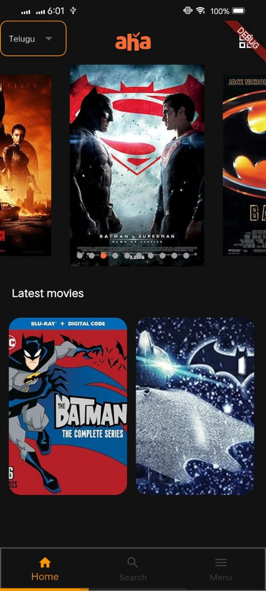

# ifarmer

🚀 **ifarmer** is a Flutter project created with RealScript.

### For production

```
fvm flutter build appbundle --flavor prod -t lib/main.dart --dart-define=ENV=PRODUCTION --dart-define-from-file=env/env.json

```

```
fvm flutter run --flavor prod -t lib/main.dart --dart-define=ENV=PRODUCTION --dart-define-from-file=env/env.json

```

```
fvm flutter build apk --flavor prod -t lib/main.dart --dart-define=ENV=PRODUCTION --dart-define-from-file=env/env.json

```

### For development

```
fvm flutter build appbundle --flavor dev -t lib/main.dart --dart-define=ENV=DEVELOPMENT --dart-define-from-file=env/env.json

```

```
fvm flutter run --flavor dev -t lib/main.dart --dart-define=ENV=DEVELOPMENT --dart-define-from-file=env/env.json

```

```
fvm flutter build apk --flavor dev -t lib/main.dart --dart-define=ENV=DEVELOPMENT --dart-define-from-file=env/env.json

```

### Home Screen



### Search Screen


### Details Screen

